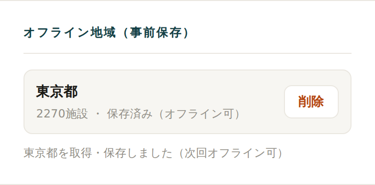

<!-- _class: title -->

# AI と作る防災アプリ

### 「災害時避難シミュレーター」制作を通じた学びと考察

開発メンバー勉強会 ／ 課題1：アプリケーションシステム作成
Kyoko Takazawa

---

## 今日話すこと

「すごいものを作った」報告ではありません。

- 何を作ったかは **さらっと**
- 中心は **作る過程で得た学び・葛藤**、そして
  **AI（Claude Code）と開発してみた所感**
- うまくいったことも、**危なかった・失敗したことも正直に**

> 「正解はない」課題なので、自分が体験して考えたことを話します

---

## 作ったもの（概要）

**災害時避難シミュレーター**
ハザードを考慮して避難所・避難ルートを提案する Web アプリ

- 災害種別（地震/津波/台風/洪水/土砂）で提案が変わる
- 危険区域（浸水域）を避けるルート
- オフライン対応・OIDC認証・HTTPS（課題の必須要件）

🔗 https://kyokoron.github.io/team-challenge/
（完全無料・GitHub Pages）

本編ではこのアプリを「学びの題材」として扱います。機能の詳細は付録に。

---

## 進め方：AI と対話しながら作った

アイデアを AIに評価させる

→

実装 （叩き台を高速生成）

→

実データ投入 （国のオープンデータ）

→

動かして 違和感を指摘

↺

 

- Claude Code に指示 → 動くものが出る → **触って気づく → 直す**、の反復
- 私の役割は「作る人」というより **「問いを立て、判断し、レビューする人」** に近かった

---

<!-- _class: section -->

## 学び ①
AI の答えを鵜呑みにしない

---

## 「DB は要らない」— 本当に？

- 最初、AI は「DBが要るのは動的更新・投稿の時だけ」と **簡略に断言**
- 「それ、総合的に考えて本当？発表で必ず突っ込まれる」と **問い直した**
- 深掘りすると論点は複数（検索性能・県境・更新・**オフライン**・コスト…）

結論：この防災アプリは<b>被災時に通信が落ちる</b>前提。<b>サーバDBは"必要な瞬間に頼れない"</b>ので、静的分割＋端末キャッシュが最適。DBを使うなら最終的に端末へ配布が必要（ハイブリッド）。

> AI は"それらしい答え"を速く出す。**問い直すと精度が上がる**。

---

<!-- _class: section -->

## 学び ②
「ミスが許されない」設計の難しさ

---

## 実際に見つけた"危うい挙動"

避難案内は誤ると命に関わる。動かして初めて気づいた例：

<b>内陸で「津波」を選ぶと海へ8km誘導</b>指定避難所が沿岸に偏在 → 逆方向は致命的

<b>架空のサンプルデータが表示され得た</b>取得失敗時に偽の避難所を出す余地

<b>"最寄り"が最寄りでない</b>広域データで距離が正規化され順位が崩れる

<b>直線距離を「徒歩◯分」と表示</b>川や線路で実際は遠い＝過小表示

---

## 学び：安全側に倒す設計に作り直した

- 対象外の地点は **遠くへ誘導せず「垂直避難を」** と警告
- **偽データを完全排除**（取得失敗は正直に止める）
- **現在地が浸水域内なら最優先で警告**（右図）
- 「できないこと（危険区域の自動回避なし等）」も**明示**

> "動く"と"正しい・安全"は別物。**AIは前者を作れるが、後者は人が問い続ける**。

---

<!-- _class: section -->

## 学び ③
オープンデータのリアル

---

## 「あるのに、取りにくい」

- 避難所・ハザードは **国のオープンデータで揃う**（無料・商用可なものも）
- が、実際は…
  - どれが正解のデータか **分かりにくい**（例：避難所は複数種別）
  - 洪水浸水想定(A31)は **河川単位** で「東京の1ファイル」が無い
  - **Shapefile** が多く、GeoJSON化・座標系・簡略化の前処理が要る
  - ルートAPI(ORS)は **回避ポリゴンの上限** があり工夫が必要

学び：<b>データ整形・前処理が実装と同じくらい重い</b>。ここをAIに任せて高速化できたのは大きかった。

---

<!-- _class: section -->

## 学び ④
無料・静的でどこまでできるか

---

## 制約の中の工夫

- **オフライン(PWA)**：地域データを IndexedDB に保存 →
  一度見た地域は **圏外でも検索が動く**
- **OIDC認証(Auth0)** を **バックエンドなし** で実現（PKCE）
- **浸水域を避けるルート**（ORSの`avoid_polygons`）
- すべて **GitHub Pages（静的・無料・HTTPS）**

> 「無料・静的」は制約だが、**設計思想（平常時に備え被災時に使う）と噛み合った**。

---

<!-- _class: section -->

## 本題：AI で開発してみた所感

---

## 得意・不得意・危ないところ

| AIが得意 | 人間の判断が必要 | 危なかった点 |
|---|---|---|
| 叩き台の高速生成 | 何を・なぜ作るか | "それっぽく動く"が正しくない |
| CSS/UI調整の反復 | 安全・倫理要件 | 偽データfallbackを平然と残す |
| データ変換・前処理 | 優先順位づけ | 誤ったランキングに気づかない |
| 定型実装・リファクタ | 「この挙動おかしい」の指摘 | レビューを怠ると事故 |

AIで開発の速度は上がる。だが"最後の判断とレビュー"は人間の仕事だと痛感。

---

## 私が介入した場面（実例）

- 「UIがAIっぽい・ださい」→ サイドバー型に刷新、幅で組み変わるUIへ
- 「津波の挙動がおかしい」→ 内陸の誤誘導を発見・修正
- 「ログインとログアウトが両方出てる」→ 表示バグを指摘・修正
- 「DBは本当に不要？」→ 設計判断を問い直し

> **AIは指摘に強い**。的確に問い返すほど、良いものに近づいた。

---

## 苦労・失敗したこと

- 動いているように見えて **裏で"偽データ・誤順位"** が潜んでいた
- データ入手・変換で何度もつまずいた（河川単位・Shapefile・API制限）
- 認証やオフラインは **一度で動かず**、原因切り分けを繰り返した
- 「見た目」は主観で、**"良い"の言語化が難しい**（何度も作り直し）

失敗の多くは「動かして初めて分かる」もの。<b>触る→気づく→直すの反復</b>が結局いちばん効いた。

---

## もし次にやるなら / 活かし方

- **最初に"安全要件・NG挙動"を言語化** してからAIに作らせる
- AIの出力は **「たたき台」** と割り切り、**必ず自分で触ってレビュー**
- データ前処理は **AIに任せて高速化**、判断は自分が持つ
- チーム開発なら「AIの成果物をどうレビューするか」の仕組みが要る

---

## まとめ（学び）

- AIで **作る速度は劇的に上がる**。ただし **"正しさ・安全・見栄え"は人が問い続ける**
- **問いを立てる力・違和感に気づく力・レビューする力** が、これまで以上に重要に
- 防災という題材で **「動く」より「間違えない」** の難しさを体感できた
- 制約（無料・静的）は、**設計思想と噛み合えば強みになる**

結論：AIは "答えをくれる相棒" ではなく、"速く形にする相棒"。舵は人が握る。

---

<!-- _class: section -->

## 付録：成果物の概要

---

## 機能・技術・データ（付録）

**主な機能**
- 災害種別に応じた避難所ランキング（理由つき）
- 浸水域を避ける避難ルート／垂直避難の警告
- 現在地の浸水域内 警告
- オフライン（PWA）／ OIDC認証 ＋ HTTPS

**技術・データ**
- Vanilla JS / MapLibre GL JS / Auth0(OIDC)
- Service Worker + IndexedDB
- 国土地理院（地図・避難所・標高）
- 国土数値情報（洪水浸水想定 A31）
- OpenRouteService（回避ルート）

🔗 https://kyokoron.github.io/team-challenge/
