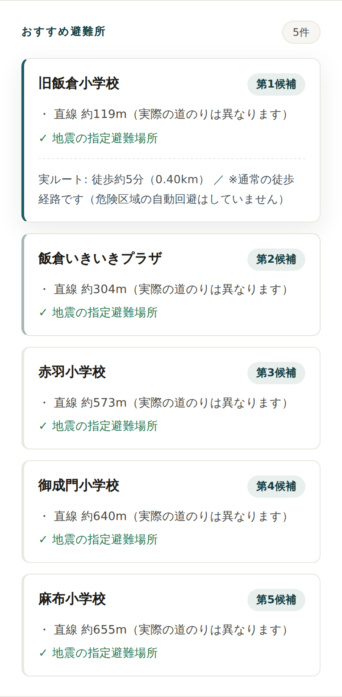
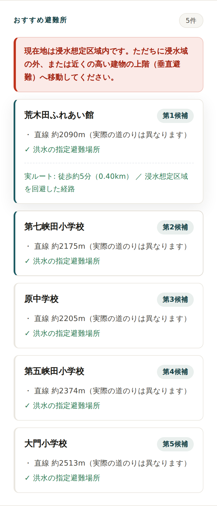

<!-- _class: title -->

# AI で防災アプリを作ってみて

### 課題への取り組みと、そこで感じたこと

開発メンバー勉強会 ／ 課題1：アプリケーションシステム作成
Kyoko Takazawa

---

## 今日の流れ

こういう課題が あった

→

まず AI で 作ってみた

→

こんな機能を 使った

→

成果物は これ

→

感じたこと （本題）

 

- 前半は **さらっと事実**、時間をかけたいのは最後の **「感じたこと」**
- 「AIで作ったもの」なので、成果自慢より **やってみて考えたこと** を共有します

---

## ① 課題

-  **課題1：アプリケーションシステムを自分で作る**
- 必須要件は **HTTPS ／ OIDC認証 ／ Git管理**
- 「正解はない」課題 → **何を作るかから自分で決める**

だから本発表も「これが正解」ではなく、<b>一つのやってみた記録と感想</b>として聞いてください。

---

## ② まず、AI で作ってみた

- 題材に選んだのは **災害時の「避難案内」アプリ**
   きっかけ：直近地震が多く、そういえばどこに避難すればいいんだろう？すぐわかるようにしたいな～と思った
- 作り方は **Claude Codeのブラウザ版で対話**

やりたいことを AIに伝える

→

動くものが 出てくる

→

触って 違和感に気づく

→

直す

↺

私の役割は「書く人」というより <b>「問いを立て・判断し・レビューする人」</b> に近かった。

---

## ③ こんな機能・データを使った

**地図・データ**
- MapLibre GL JS ＋ 国土地理院タイル
- 指定緊急避難場所・標高（国土地理院）
- 洪水浸水想定 A31（国土数値情報）

**経路**
- OpenRouteService（徒歩・浸水域を避ける）

**アプリ基盤**
- オフライン：Service Worker ＋ IndexedDB（PWA）
- 認証：Auth0（OIDC / PKCE・バックエンドなし）
- 公開：GitHub Pages（無料・HTTPS）

<small>すべて無料の範囲。サーバもデータベースも立てていない（＝完全な静的サイト）。</small>

---

## 課題の必須要件は、こう満たした

| 必須要件 | どう満たしたか |
|---|---|
| **HTTPS** | GitHub Pages が標準で HTTPS 配信 |
| **OIDC認証** | Auth0 で Authorization Code ＋ PKCE（クライアントシークレット不要） |
| **Git管理** | GitHub でブランチ運用・履歴管理・レビュー |

サーバを持たない静的サイトでも、要件（認証・HTTPS）は<b>外部サービスの組み合わせで満たせた</b>。

---

## ④ 成果物：災害時避難シミュレーター

- 災害種別（地震／津波／台風／洪水／土砂）で **提案が変わる**
- 危険区域（浸水域）を **避けるルート**
- **オフライン**でも一度見た地域は検索できる

🔗 https://kyokoron.github.io/team-challenge/

機能・技術の詳細は付録に。ここからが本題の「感じたこと」です。

---

<!-- _class: section -->

## ⑤ 感じたこと

---

## 感じたこと（1）AIの答えを鵜呑みにしない

- 最初、AIは「DBが要るのは動的更新・投稿の時だけ」と **簡単に断言**
- 「それ本当？」と **問い直した**
- 深掘りすると論点は複数（検索性能・県境・更新・**オフライン**・コスト…）

結論：この防災アプリは<被災時に通信が落ちる前提。 サーバDBは"必要な瞬間に頼れない"ので、静的＋端末保存が理にかなう。

> AIは"それらしい答え"を速く出す。**問い直すと精度が上がる**。

---

## 感じたこと（2）「動く」より「間違えない」が難しい

避難案内は誤ると命に関わる。**触って初めて気づいた危うさ**：

<b>内陸で「津波」を選ぶと海へ8km誘導</b>指定避難所が沿岸に偏在 → 逆方向は致命的

<b>架空のサンプルデータが出得た</b>取得失敗時に"偽の避難所"を出す余地

<b>"最寄り"が最寄りでない</b>広域データで距離が正規化され順位が崩れる

<b>直線距離を「徒歩◯分」表示</b>川や線路で実際は遠い＝過小表示

「動くもの」はAIがすぐ出す。でも "正しい・安全" は別物だった。

---

## 感じたこと（2つづき）安全側に倒すまで直した

- 対象外の地点は遠くへ誘導せず **「垂直避難を」と警告**
- **偽データを完全排除**（取れなければ正直に止める）
- **現在地が浸水域内なら最優先で警告**（右図）
- できないこと（危険の完全自動回避は不可 等）も **明示**

> "動く"を作れるのはAI。**"間違えない"を問い続けるのは人**だと痛感した。

---

## 感じたこと（3）オープンデータのリアル

- 避難所・標高・ハザードは **国のオープンデータで揃う**（無料・商用可も）
- が、実際に使うと…
  - どれが正解のデータか **分かりにくい**（避難所は複数種別）
  - 洪水浸水想定(A31)は **河川単位**で「東京の1ファイル」が無い
  - **Shapefile** が多く、GeoJSON化・座標変換の前処理が要る
  - ルートAPI(ORS)は **回避ポリゴンに上限**があり工夫が必要

「データはある」と「すぐ使える」は別物。<b>整形・前処理が実装と同じくらい重い</b>と実感。

---

## 感じたこと（4）AI時代、価値の中心が動く

<h3>従来</h3>

ユーザー↓ UIを操作UI（アプリ）↓機能（ロジック）↓データ

価値の中心：UI設計・機能開発・実装

<h3>AI時代</h3>

ユーザー↓ 目的を伝えるAI（理解・推論）↓データ

価値の中心：① ドメイン理解　② 良いデータ　③ 何を解くべきか

コードを書くことよりも、<b>「何を解くべきか」</b>の方が重要になる。

---

## 今回、私が握っていたのも まさにそこ

<b>① ドメイン理解</b>防災の安全要件。「津波で海へ誘導」の危うさに気づけたのは、コードでなく人の理解

<b>② 良いデータ</b>国のオープンデータを"使える形"に整える前処理が品質を左右した

<b>③ 何を解くべきか</b>「動く」より「間違えない」。問いを立て直し、レビューし続けた

<b>＝ 実装の速さはAIに任せ</b>私はこの3つに集中していた（と、後から気づいた）

---

## 感じたこと（5）この資料も Markdown（Marp）で作った

- スライドを **文章（テキスト）で書く** ツール。図を並べる代わりに構造を文字で書く
- なぜ AI 時代に相性がいいと感じたか
  - **AIが読める・書ける・直せる** ―「ここ直して」で即反映（この資料が現にそう）
  - **Git で差分管理** できる＝スライドをコードと同じように扱える
  - **中身とデザインが分離**（テーマ固定 → 中身だけ高速に直せる）

「テキストで伝える → AIが形にする」時代に、<b>スライドもテキストで持てるMarpは相性が良い</b>。ただし作り込んだビジュアル勝負なら、Canvaや従来ツールが今も有利。

---

## 後から知った：この実感、公式ガイドと重なっていた

Anthropic（Claudeの開発元）も、AI活用のコツとして近いことを言っていた。

<b>「自分が何を知らないか」を明確にするほどAIが活きる</b>盲点（未知の未知）はAIに聞け → 「DB本当に要る?」「これ危なくない?」と問い直すほど質が上がった

<b>「地図は現地ではない」</b>指示とAIの理解にはギャップがある → 指示通り"動いた"のに、津波誤誘導・偽データ…触って初めてズレに気づいた

<b>実装後、変更点を自分が理解する工夫を</b>レビューを怠ると事故る。次はもっと仕組みとして持ちたい

<b>手探りの実感が、公式の"コツ"と一致していた</b>遠回りに見えて本質は同じ。だから腑に落ちた

<small>参考：ナレッジセンス「Fable時代のAI活用法を、Anthropicの開発者が公開」(Zenn) ／ Anthropic 公式ガイド</small>

---

## 苦労・失敗したこと

- 動いて見えて、裏で **"偽データ・誤順位"** が潜んでいた
- データ入手・変換で何度もつまずいた（河川単位・Shapefile・API制限）
- 認証やオフラインは **一度で動かず**、原因切り分けを繰り返した
- 「見た目が微妙」を直すのが難しい（**"良い"の言語化**が難しく作り直し多数）

失敗の多くは「動かして初めて分かる」もの。<b>触る→気づく→直す</b>の反復が結局いちばん効いた。

---

## まとめ

- **AIで作る速度は劇的に上がる**。ただし "正しさ・安全・見栄え" は **人が問い続ける**
- 防災という題材で、**「動く」より「間違えない」の難しさ**を体感した
- AI時代の価値の中心は **ドメイン理解・良いデータ・何を解くべきか** に移る
- 無料・静的でも、要件（認証・HTTPS・オフライン）は **工夫で満たせた**

一番の収穫は、成果物そのものより「<b>どこを自分が握るべきか</b>」が見えたこと。

---

<!-- _class: section -->

## 付録：成果物の概要

---

## 機能・技術・データ（付録）

**主な機能**
- 災害種別に応じた避難所ランキング（理由つき）
- 浸水域を避ける避難ルート／垂直避難の警告
- 現在地の浸水域内 警告
- オフライン（PWA）／ OIDC認証 ＋ HTTPS

**技術・データ**
- Vanilla JS / MapLibre GL JS / Auth0(OIDC)
- Service Worker + IndexedDB
- 国土地理院（地図・避難所・標高）
- 国土数値情報（洪水浸水想定 A31）
- OpenRouteService（回避ルート）

🔗 https://kyokoron.github.io/team-challenge/
