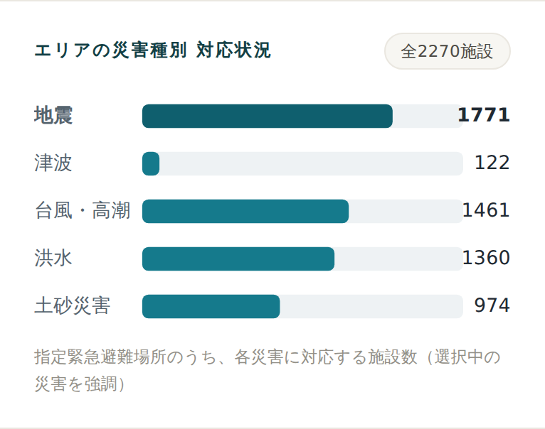

<!-- _class: title -->

# 災害時避難シミュレーター

### ハザードを考慮した、避難の意思決定支援 Web アプリ

Kyoko Takazawa
🔗 https://kyokoron.github.io/team-challenge/

---

## 背景と課題

- 災害時、多くの人は **「どこへ・どう逃げるか」** を即座に判断できない
- 既存の地図サービス（Google マップ等）は **最短経路** は出せるが
  **災害の危険（浸水・高台・指定避難場所）を考慮しない**
- 国のハザードマップは正確だが、**「あなたが今すべき行動」** は示さない

<b>本アプリが埋める空白</b>
ハザードを踏まえた「今どこへ、どう逃げるか」の<b>意思決定</b>を、その場で支援する。

---

## 数字で見る

<b>2,270</b>避難所データ（東京都）

<b>¥0</b>運用コスト

<b>5</b>災害種別に対応

<b>圏外</b>オフラインでも動作

 

完全無料・静的サイト（GitHub Pages）で、実データと実動作まで到達。

---

## コンセプト

「危険を避ける」避難案内 ＋ 平常時に備え、被災時に使う設計

- 災害種別（地震／津波／台風・高潮／洪水／土砂）に応じて **最適な避難所とルート** を提案
- 単なる最短経路ではなく、**ハザードを考慮した意思決定支援**
- 「ミスが許されない」前提で、**誤案内を生む要素を排除**する安全設計

---

## 主な機能

- 現在地取得（不可時は地図タップ指定）
- 地図・ハザードの重畳表示
- **災害種別に応じた避難所ランキング**（推奨理由つき）
- **危険区域を避ける避難ルート**

- **現在地が浸水域内なら警告**（垂直避難）
- **オフライン対応（PWA）**
- **OIDC 認証（Auth0）＋ HTTPS**
- 地域データの選択保存

---

<!-- _class: section -->

## 差別化の核 ①
ハザードを考慮した避難所提案

---

## 避難所ランキング

- その災害に **「指定された」避難所のみ** を候補にする
  （津波なのに非対応の低地施設を勧めない）
- **最寄り K 件に絞ってから評価** → 必ず近い順を担保
- **津波・高潮は標高で高台を優先**（標高API）
- 推奨理由を明示：
  `直線 約119m` / `地震の指定避難場所`

<small>※ 距離は直線距離と明示。徒歩時間は実ルートのみを正とし過小表示を避ける。</small>

---

## データに基づく気づき

- エリアの **指定緊急避難場所を災害種別で集計**
- 東京都で **津波対応は 122 / 2,270 施設のみ**
  → 沿岸に偏在。内陸は対象外が多い
- この事実が **「内陸で津波→垂直避難」** の設計根拠に

---

<!-- _class: section -->

## 差別化の核 ②
危険区域を避ける避難ルート

---

## 浸水を「実際に」避けるルート

- 洪水・台風時、**浸水想定区域(国土数値情報 A31)を避けて**経路を引く
  （OpenRouteService の `avoid_polygons`）
- ルート周辺の浸水ポリゴンだけ送信し API 制限内に収める

<b>逃げ場が浸水で囲まれている場合</b>
「安全な経路が見つかりません。<b>垂直避難</b>を検討」と警告

<b>回避しない経路は明示</b>
「危険区域の自動回避はしていません」と表示し過信を防ぐ

> 「見えているだけ」でなく「実際に避ける」— ここが本アプリの核心

---

## 現在地の危険を最優先で警告

- 浸水ポリゴンに対する **点 in ポリゴン判定**
- **現在地が浸水域内なら**、避難所より先に
  「**ただちに浸水域の外／垂直避難を**」を最上部に表示
- 「今あなたが危険な場所にいる」を最初に伝える

---

## 安全設計（ミスが許されない）

<b>偽データを出さない</b>架空のサンプルとフォールバックを完全排除

<b>対象外を誘導しない</b>内陸で津波→海側でなく垂直避難を案内

<b>できないことを明示</b>回避なしの経路は「自動回避なし」と表示

<b>無反応を放置しない</b>ルート探索にタイムアウト＋状況表示

 

<small>常に「参考情報」であることと出典（国土地理院・国土数値情報）を明記。</small>

---

## システム構成（すべて無料・静的）

  
ブラウザ（PWA ／ Auth0 で OIDC 認証）

  
▼

  

    
地図・ハザード 国土地理院タイル

    
避難所 GeoJSON → IndexedDB に保存

    
標高API ルート(OpenRouteService)

  

  
▼

  
配信：GitHub Pages（静的・無料・HTTPS）　／　バックエンド・DB なし

---

## オフライン設計 ＝ 被災時の要件

**「平常時（オンライン）に備え、被災時（オフライン）に使う」**

- 地点→地域は **bbox でローカル判定**（逆ジオコーディング不要）
- 検索地域を **自動保存**、他地域は **手動保存**（旅行前の備え）
- 保存は **IndexedDB**、本体・タイルは **SW Cache**
- 一度保存すれば **圏外でも検索が動く**

---

## 想定質問：なぜ DB を使わない？

- 災害時は **サーバ／通信が落ちうる** → サーバ DB は「必要な瞬間に頼れない」
- 読み取り専用の公開データなら **静的分割＋端末キャッシュ** が最適・無料・無停止
- DB が要るのは **リアルタイム開設情報・ユーザー投稿・頻繁更新** を足すとき

結論：本アプリの<b>オフライン要件</b>が、むしろ DB を不利にする。使うとしても最終的に<b>端末へ配布</b>が必要（ハイブリッド）。

---

## 認証（必須要件）と HTTPS

- **OIDC（Auth0 / Authorization Code + PKCE）** を
  バックエンドなしの静的サイトで実現
- 中核（地図・避難所検索）は **ログイン不要**
  （災害時にログイン画面が命の情報を塞がない）

- **HTTPS** は GitHub Pages で充足
- Google 連携（ソーシャルログイン）＝
  **OIDC フェデレーション**も実演可能

---

## 使用データ・API（無料 / オープンデータ）

| 用途 | データ・API |
|---|---|
| 地図 | 国土地理院タイル |
| ハザード表示 | 重ねるハザードマップ（洪水/津波/高潮/土砂） |
| 避難所 | 国土地理院「指定緊急避難場所データ」(東京都 2,270件) |
| 洪水回避 | 国土数値情報「洪水浸水想定区域」(A31) |
| 標高 | 国土地理院 標高API |
| ルート探索 | OpenRouteService（無料枠） |

---

## 技術スタック

- **フロント**：HTML / CSS / Vanilla JS（ES Modules）
- **地図**：MapLibre GL JS
  （数千点は円レイヤ、上位のみピン）
- **オフライン**：Service Worker + IndexedDB（PWA）

- **認証**：Auth0 SPA SDK（OIDC / PKCE）
- **ホスティング**：GitHub Pages（静的・無料・HTTPS）
- **データ整形**：Node（Shapefile/GeoJSON → 軽量化）

---

## デモの流れ

1. ログイン（Google で続ける）※中核は未ログインでも可
2. 港区で「現在地から避難所をさがす」→ 近い順に理由つきで提案
3. **災害を切り替える**（地震 vs 洪水）でルート・優先度が変わる
4. **洪水**：東側の低地を起点に → **浸水域を避けるルート**
5. **オフライン実演**：地域を保存 → 機内モードでも検索が動く

---

## 弱点・今後の展望

### 正直に示す限界
- 回避は洪水のみ（土砂 A33 は今後）
- 「今その避難所が開設中か」は静的では不可
- 対応は東京都のみ（仕組みは全国対応・データ追加のみ）

### 拡張
- 他県データ追加／土砂の回避
- 地震 vs 洪水の **比較モード**
- 標高プロファイル／要配慮者モード

---

## まとめ

- **ハザードを考慮した避難意思決定支援**を **完全無料・静的**で実装
- 差別化の核＝**危険区域を避けるルート** と **現在地の危険警告**
- 「ミスが許されない」前提の **安全設計**（誤案内・偽データの排除）
- **オフライン（PWA）× OIDC 認証 × HTTPS** を両立
- 設計思想「**平常時に備え、被災時に使う**」を体現

🔗 https://kyokoron.github.io/team-challenge/

---

<!-- _class: section -->

## 付録：想定 Q&A

---

## 想定 Q&A

**Q. Google マップと何が違う？**
危険（浸水・高台・指定避難場所）を考慮し、**回避ルート**と**推奨理由**を出す。

**Q. 県境の避難所は？**
行政界分割の弱点。メッシュ／隣接地域バッファで補える設計。

**Q. データ更新は？**
公開データから静的ファイルを再生成 → SW で更新。

**Q. 認証があるのに静的？**
OIDC はクライアント完結。データ配信と責務分離。

